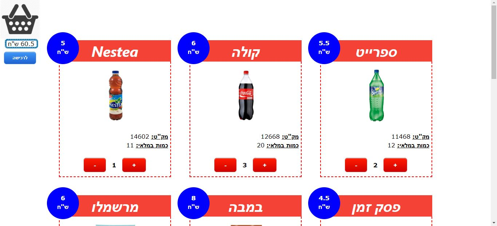

# CafeteriaOnlineStock

Online stock for Cafeteria products.
This project is based on the 4-layer model:
- Database (Sql server)
- Data access (Class library, Entity framework)
- Business logic (Web service, Web API)
- UI (JS, HTML, CSS, Jquery)
 
<h2 style="text-decoration: underline;">Pages Screenshots:</h2>
                                                                                                                               

    <h3>Login Page</h3>
    

=================================================================================

    <h3>Purchase Page</h3>
                                                                                                                                   
    

=================================================================================

    <h3>Checkout Page</h3>
    

